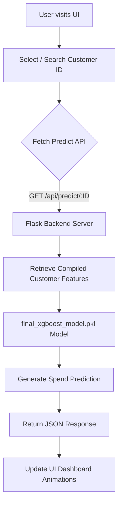

# HCL Retail AI Sales Predictor

A premium, full-stack web application designed to forecast customer spending over the next 30 days. It uses a provided XGBoost machine learning model trained on historical purchase data to predict future behaviors, presented in a sleek, modern, glassmorphism UI.

![Frontend Preview]

## Project Overview

This project consists of two main components:
1.  **Python / Flask Backend (`/backend`)**: Serves as the inference engine. It processes the raw transaction data to compute Recency, Frequency, Monetary (RFM) and other advanced business metrics. It loads the `final_xgboost_model.pkl` to generate lightning-fast API responses.
2.  **HTML / CSS / JS Frontend (`/frontend`)**: A visually striking, dependency-free vanilla web application. It features a dark mode aesthetic with glass panels, micro-animations, and animated number counters for a deeply engaging user experience.

---

## 🚀 Getting Started

### Prerequisites
Make sure you have Python 3.8+ installed.


### 1. Setup the Backend
The backend utilizes Python and requires some dependencies to serve the machine learning predictions.

1. Open a terminal and navigate to the backend folder:
   ```bash
   cd backend
   ```
2. Install the required Python packages:
   ```bash
   pip install -r requirements.txt
   ```
3. *(Optional but recommended)* Pre-compute the customer features to speed up server start time. This reads `sales_06_FY2020-21 copy.csv` from the root directory and creates structured features:
   ```bash
   python prepare_data.py
   ```
4. Start the Flask server:
   ```bash
   python app.py
   ```
   *The API will now be listening on `http://localhost:5000`.*

### 2. Setup the Frontend
The frontend is built with pure HTML/CSS/JS and does not require complex build steps, node modules, or bundlers.

1. Open a **new** terminal window and navigate to the frontend folder:
   ```bash
   cd frontend
   ```
2. Start a simple static HTTP server (or open `index.html` directly in your browser):
   ```bash
   python -m http.server 8080
   ```
3. Open your web browser and navigate to exactly:
   ```
   http://localhost:8080
   ```

---

## ⚙️ How It Works

### The Data Pipeline
*   **Feature Engineering**: Raw transaction rows are aggregated intelligently. The backend calculates:
    *   `recency`: Days since the customer's last purchase.
    *   `frequency`: Total number of separate orders an account has made.
    *   `monetary`: The total lifetime spend of the given customer.
    *   `avg_order_value`: Average spend per transaction.
    *   `spend_per_day`: Average spend scaled by recency.
    *   `loyalty_score`: A derived metric combining high frequency and monetary value.
*   **Model Inference**: These calculated features are passed into the `final_xgboost_model.pkl` which predicts the numerical outcome.

### The API Endpoints
*   `GET /api/customers`: Returns a list of available customer IDs for the frontend search functionality.
*   `GET /api/predict/<cust_id>`: Looks up the matching user's precomputed RFM metrics, calculates standard features, retrieves the prediction, and returns a combined JSON payload.

## 🎨 Design Features
The UI/UX focuses on a premium and performant "wow" factor:
*   **Cyber Violet Palette:** Deep `rgba(10, 10, 15)` background with soft bioluminescent blobs (pure CSS) bouncing in the background.
*   **Glassmorphism Cards:** Semi-transparent panels with backdrop filters blur the animated blobs underneath.
*   **Responsive Typography:** Incorporating `Inter` for precise data legibility and `Outfit` for striking headers.
*   **Interactive Feedback:** Input field glows, list dropdowns slide natively, and data points increment dynamically `(0 -> $163.82)` over 1.5 seconds when loaded.

## 📁 Repository Structure

```
├── Sales.ipynb                # Initial Jupyter notebook and modeling workflow
├── final_xgboost_model.pkl    # Serialized XGBoost regression model
├── sales_06_FY2020-21 copy.csv# Raw customer data
├── backend/
│   ├── app.py                 # Flask server and prediction API
│   ├── prepare_data.py        # Utility script to generate static CSV of calculated RFM features
│   └── requirements.txt       # Dependencies (flask, xgboost, pandas, scikit-learn, etc.)
└── frontend/
    ├── index.html             # The dashboard layout
    ├── script.js              # Fetch API connectivity & DOM manipulation
    └── styles.css             # Vanilla CSS design system
```

## 🗺️ Roadmap

- [x] Initial Data Exploration and Model Training
- [x] Backend API Development using Flask
- [x] Frontend UI Implementation with Glassmorphism
- [ ] Add User Authentication and Authorization
- [ ] Implement Real-Time Sales Dashboard
- [ ] Integrate Advanced Analytics & Visualizations
- [ ] Support for Multiple Stores/Regions

## 🔄 Workflows

### 1. Data Preparation Workflow
1. Raw CSV data loaded from `sales_06_FY2020-21 copy.csv`
2. Data cleaned and pre-processed
3. RFM (Recency, Frequency, Monetary) features calculated
4. Processed data saved for fast inference

### 2. Model Inference Workflow
1. User selects Customer ID on Frontend
2. API Request sent to Backend `GET /api/predict/<cust_id>`
3. Backend fetches pre-calculated customer features
4. XGBoost model predictors are run against the data
5. Expected sales for the next 30 days are calculated
6. JSON response returned to Frontend
7. UI updates dynamically with satisfying number animations

## 📊 Application Flowchart



## 📱 How to Use the Application

1. **Start the Services**
   - Ensure both the backend Flask server (`localhost:5000`) and the frontend HTTP server (`localhost:8080`) are running as described in the Getting Started section.
2. **Access the Dashboard**
   - Open your web browser and navigate to `http://localhost:8080`.
3. **Select a Customer**
   - Locate the customer dropdown or search bar on the dashboard.
   - Select or type a valid Customer ID from the provided list.
4. **View Sales Predictions**
   - Upon selection, the dashboard will automatically fetch current metrics.
   - The UI will beautifully animate and display the predicted sales for the customer over the next 30 days.
   - Review the detailed underlying RFM features (Recency, Frequency, Monetary value) updating on the glass panels.

